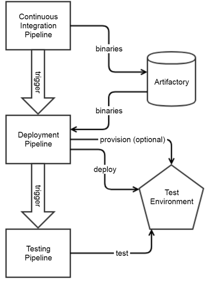
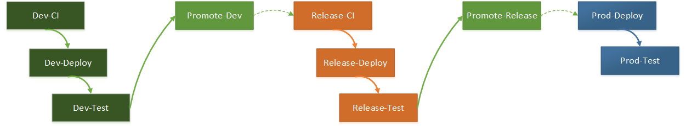

## Introduction
In the old days we used to configure Jenkins jobs by filling endless HTML forms in Jenkins.  This was tedious and quickly resulted into maintenance nightmare when you had to fix something wrong that had been done in many jobs.  Also, you had no version control on your jobs configuration.  It wasn't easy to figure out who changed what.  Should the job be deleted by mistake... well you had to reconfigure everything by hand and try to figure out how the job was previously configured.  That era is now over!

## Getting support and Additional Information
Look at our [Confluence Site](https://cpcnissgwp01.americas.manulife.net:23200/pages/viewpage.action?spaceKey=DG&title=Jenkins+Pipelines) for more information. 

## Why Jenkins Pipelines as Code
Since a few years now, Jenkins supports the notion of Pipelines as code.  You can now create a Groovy program that contains all the steps a job has to perform and how the Jenkins job has to be configured.  That program can be stored in Git so that you benefit from versioning like for any other source code.  This already solves many of the issues with the old way of configuring Jenkins jobs.

If we look at a typical Jenkins Continuous Integration (CI) pipeline, we see that it performs the following things:
- Checkout the source code from Git
- Resolve the project dependencies (open-source or Manulife libraries) with Artifactory
- Call the compiler
- Run the unit tests
- Perform a code quality scanning using SonarQube
- Perform a security code scanning with Fortify
- Check that the project is compliant with our open-source governance with BlackDuck
- Check that the project is compliant with our open-source governance with Snyk
- Store the resulting artifact(s) on Artifactory
- Trigger the execution of a deployment pipeline
- Notify the developers of the pipeline outcome

A typical Jenkins Deployment pipeline will performs the following things:
- Retrieve the binary artifacts from Artifactory
- (optional) Provision the environment (WebSphere instance, IIS instance, ...)
- Deploy the application
- Keep track of which version is deployed into which environment
- Trigger the execution of the test pipeline(s)
- Notify the developers and devops of the pipeline outcome

A typical Jenkins Code Promotion pipeline will performs the following things:
- Increase the project's minor version in develop branch (when promoting to release)
- Copy the source code from develop to release branch or from release to master
- Fix the version in destination branch (from pre-release to release) if required
- Generate release notes (appends new version to existing release notes file) and store in Git repo

Finally, a Jenkins test pipeline will:
- Execute the functional tests on the application
- Notify the QA analysts, the developers and devops of the pipeline outcome

Then, we also need pipelines to take care of the code promotions between branches if we want to get to Continuous Deployment at some point.
Each technology has a different way of dealing with versioning and this also involves quite a few Git commands!

There are a lot of tools involved here and they are called in a very similar way form one project to another.
We need a way to make it easy for project teams to configure the pipelines for a new project.
One option would be to create a Git repo with pipeline templates and ask the teams to copy those pipelines in their project repository and adjust the pipelines so that they work for that project.

That would certainly work but would involve 3 things:  
1. We would need to spend quite a fair amount of time training everyone on how to modify the code of the pipelines
1. Every time we would find a problem in the pipeline templates or want to introduce a new tools that should be used in all pipelines we would also have to train everyone on this and fix all the existing project pipelines!
1. Enforcing standard naming conventions wouldn't be easy since every team would be free to modify the pipelines so that they do something different from the intended standards

This is why we explored the idea of having a generic pipelines library.
Since Jenkins pipelines are coded in Groovy they can be handled as any other program and stored in their own Git repository.
Project teams can simply run pipelines (programs) from that library instead of copying the pipeline code in their project.
In a project we will only have configuration files that will tell the generic pipelines about a few values that will be different from one project to another.
Should we find a problem or want to introduce a new tool?  We simply have to fix the generic pipelines code.
In the worst case, our projects will have to be configured with more information for the pipelines but this is much easier to handle than having to modify our pipelines code.

## Using the Generic Jenkins Pipelines
### Configuring your Business Unit Folder with the Generic Pipelines repository
> Note:  This has to be done only once and before your Business Unit starts using the Jenkins Generic Pipelines.
>

In Jenkins, click on the folder of your Business Unit.  Then, on the left side, click on the "Configure" menu option.
Once the configuration panel is opened, look for the "Pipeline Libraries" section.

- Press the Add button to start defining a new shared library
- Capture the following information:
  * Name: Manulife
  * Default Version: release/1.2
  * Load Implicitly:  Yes
  * Allow default version to be overriden: yes
  * Include @Library changes in job recent changes:  No

In the retrieval section, select "Legacy SCM" and then select the "Git" option.
Then fill in this section of the form with the following information:
- Repository URL: ssh://git@gitlab.manulife.com:2222/CDT\_Common/JenkinsGenericPipelines.git
- Credentials: Select your BU Service Account SSH Credentials
- Branch Specifier:  \*/release/1.2

Note: You may have to replace \*/release/1.2 with the path to the release that you wish to use.

- In Additional Behaviours:
  * Add "Clean before checkout"
  * Add "Wipe out repository & force clone"

The Generic Pipelines are also making some assumptions about what is configured in the "Credentials" and "Config Files" for your Business Unit.  It requires the following things to be configured:
  * Credentials:
    * SonarQubeToken: Secret text that contains the token for your BU system account in SonarQube (sonar.manulife.com)
    * SonarQubeToken\_Test: Secret text that contains the token for your BU system account in SonarQube (sonar-test.manulife.com)
    * GitLabApiTokenText: Secret text that contain the API token of your BU GitLab service account.  Note:  Due to a bug, this must currently be configured as a username/password credential vault entry and you must put the GitLab API token in the password field.
    * (your-BU-Name)-SSH: Private key of your BU GitLab service account
  * Config Files:
    * nuget.config: "Custom" file that specifies the name of your BU Nuget Artifactory repositories + BU Artifactory service account
    * settings.xml: "Maven Settings.xml" file that specifies the name of your BU Maven Artifactory repositories + BU Artifactory service account
    * XUnitToNUnit.xslt: "Custom" file that has the [following content](docs/files/XUnitToNUnit.xslt).  Those are the credentials that should be used by ALL your Jenkins jobs

That's it, you can now use generic Jenkins pipelines for your projects!!!

### Using the Generic Pipelines

#### Continuous Integration
- [Continuous Integration Pipeline for Adobe Experience Manager (AEM) with Maven](docs/pipelineAEMMavenContinuousIntegration.md)
- [Continuous Integration Pipeline for DotNet Classic (Non-core)](docs/pipelineDotNetClassicContinuousIntegration.md) 
- [Continuous Integration Pipeline for DotNetCore2](docs/pipelineDotNetCoreContinuousIntegration.md)
- [Continuous Integration Pipeline for GoLang (Alpha Version)](docs/pipelineGoContinuousIntegration.md)
- [Continuous Integration Pipeline for Gradle](docs/pipelineGradleContinuousIntegration.md)
- [Continuous Integration Pipeline for Java/Maven](docs/pipelineJavaMavenContinuousIntegration.md)
- [Continuous Integration Pipeline for Node JS](docs/pipelineNodeContinuousIntegration.md)
- [Continuous Integration Pipeline for Swift](docs/pipelineSwiftContinuousIntegration.md)
- [Continuous Integration Pipeline for Nifi](docs/pipelineNifiContinuousIntegration.md)
- [Continuous Integration Pipeline for Shell Script Execution](docs/pipelineShellExecContinuousIntegration.md)
- [Continuous Integration Pipeline for Docker](docs/pipelineDockerContinuousIntegration.md)
- [Continuous Integration Pipeline for Python](docs/pipelinePythonContinuousIntegration.md)

##### Publish SonarQube results in GitLab on Merge Requests:
- [How to configure](docs/sonarqube-publish-on-mr.md)

#### Deployment
- [Deploy Report to Microsoft SSRS](docs/pipelineDeployReportToSSRS.md)
- [Deploy to Hadoop](docs/pipelineDeployToHadoop.md)
- [Deploy to PCF](docs/pipelineDeployToProvisioningAPI.md)
- [Deploy to PCF using Concourse ](docs/pipelineDeployToPCF.md)
- [MSBuild Publish Profile](docs/pipelineMSBuildDotNetPublishProfile.md)
- [Deploy to Nifi](docs/pipelineDeployToNifi.md)
- [Publish file for Shell Execution](docs/pipelineDeployShellExec.md)

#### Test
- [Integration Test Pipeline for Java/Maven](docs/pipelineJavaMavenIntegrationTest.md)
- [Integration Test Pipeline for Node](docs/pipelineNodeIntegrationTest.md)
- [Testing Pipeline for Java/Selenium](docs/pipelineJavaSeleniumTesting.md)

#### DB Migration
- [Database migration using Flyway (Alpha Version)](docs/pipelineFlywayDatabaseMigration.md)

#### Source Code Promotion
- [Promotion Pipeline for DotNetCore2](docs/pipelinePromotionDotNetCore.md)
- [Promotion Pipeline for Gradle](docs/pipelinePromotionGradle.md)
- [Promotion Pipeline for Maven](docs/pipelinePromotionMaven.md)
- [Promotion Pipeline for NodeJS](docs/pipelinePromotionNodeJS.md)

#### Others
- [Execute HQL on Hadoop](docs/pipelineExecuteHQLOnHadoop.md)

## More Information
- More general information about how to use the generic Jenkins pipelines can be found on [Confluence](https://dsconfluence.manulife.com:8443/display/DG/Jenkins+Pipelines)
