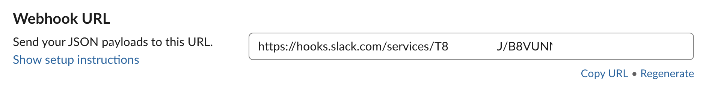

## Introduction

All the Generic Jenkins Pipelines do support notifications in the same way.  
At the end of the job execution, Jenkins will send all the notifications as configured.

Currently, notifications are possible on the following channels:
* emails
* Slack

Your project is free to use (or not) each of the available notification channels.

## Enabling notifications for your project
Each notification channel is optional.  You can use any or even of mix of the available channels in the same job configuration.

### Email
If you specify the emailJenkinsNotificationsTo property in your pipeline properties file, the pipeline will send emails at the end of the pipeline execution with:
* The outcome of the pipeline execution
* The changes included in that build
* The unit tests execution result
* The stack trace if the job failed

| Common? | Property Name | Explaination | Possible Values | Default Value |
| -------------| -------------| ------------- | ------------ | --------------- | ------------- |
| No | emailJenkinsNotificationsTo | Email address of people who should be notified after a job is executed | Comma separated list of email addresses | null |

### Slack
If you want your pipeline to send notifications on a Slack channel at the end of a pipeline execution, you can provide the 3 configuration values in your pipeline properties file.

| Common? | Property Name | Explaination | Possible Values | Default Value |
| -------------| ------------- | ------------ | --------------- | ------------- |
| Yes | slackChannel | The name of your Slack channel. This value should only be provided if you want to override the default webhook defined channel. | devops-releases | null |
| Yes | slackTokenCredentialID | Jenkins credential ID that is mapped to your Slack Web Hook token. | SLACK_TOKEN_SA | null |

*Note each BU/Team will be responsible for adding their own slack web hook token into their credentials store in Jenkins.  
1. Create a webhook within your Slack space. [Instructions](https://get.slack.help/hc/en-us/articles/115005265063-Incoming-WebHooks-for-Slack)
2. After successfully creating a web hook it will provide a URL that looks like the screenshot provided. Copy everything after the URL in the quotes "https://hooks.slack.com/services/".

3. Navigate to Jenkins in your specific BU/Team folder. Add the credentials with the type being **secret text**
Secret: paste the copied token from Slack
ID: give it a meaningful name as this is what will be referenced in slackTokenCredentialID property
Description: Use the ID name plus it is helpful to add the default slack #channel it is associated with 
